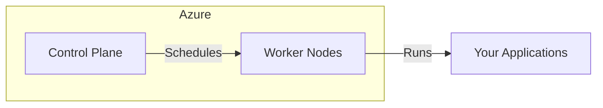

# Shared Responsibility in Azure Kubernetes Service (AKS)

This module explains the shared responsibility model in AKS, clarifying which tasks are managed by Azure, which are the customer's responsibility, and where Platform Operations teams fit in. Understanding these boundaries is critical for secure and reliable operations.

---

## Learning Objectives

- Understand the division of responsibilities between Azure, customers, and platform operations teams
- Identify responsibility boundaries in AKS (control plane vs worker nodes)
- Distinguish between infrastructure and workload security tasks

---

## 1. Azure vs Customer vs Platform Operations

In a managed Kubernetes service like AKS, responsibilities are shared:

| Area                | Azure (Cloud Provider)         | Customer (You)           | Platform Ops Team         |
|---------------------|-------------------------------|--------------------------|---------------------------|
| Control Plane Mgmt  | ✔                             |                          |                           |
| Worker Node Infra   | ✔ (if using VMSS/managed)     |                          |                           |
| Node OS Patching    | ✔ (auto-updates, unless custom)|                          |                           |
| Cluster Upgrades    | ✔ (when triggered by you)     | ✔ (initiate/approve)     | ✔ (coordinate/monitor)    |
| Network/Storage     | ✔ (cloud infra)               | ✔ (custom config)        | ✔ (policy/monitoring)     |
| Workload Security   |                               | ✔                        | ✔ (enforce/policy)        |
| App Deployment      |                               | ✔                        |                           |
| RBAC/Access Control |                               | ✔                        | ✔ (governance)            |

**Key Points:**
- Azure manages the control plane and underlying infrastructure.
- Customers are responsible for workloads, security, and access control.
- Platform Ops teams may enforce policies, coordinate upgrades, and monitor compliance.

---

## 2. Responsibility Boundaries

### a. Control Plane vs Worker Nodes

- **Control Plane:** Managed by Azure. Includes API server, etcd, scheduler, and controllers. You do not have direct access.
- **Worker Nodes:** Run your application workloads. You may have access (e.g., SSH if enabled), and are responsible for what runs here.

**Diagram:**

---

### b. OS Patching vs Workload Security

- **OS Patching:**
	- Azure auto-patches node OS if using managed node pools.
	- If using custom images or self-managed nodes, you must patch.
- **Workload Security:**
	- You are responsible for container image security, runtime security, and application-level vulnerabilities.
	- Use tools like Azure Defender for Kubernetes, image scanning, and network policies.

**Best Practices:**
- Regularly review Azure's shared responsibility documentation.
- Use Azure Policy to enforce security standards.
- Automate vulnerability scanning for images and workloads.

---

## Summary

The shared responsibility model in AKS ensures that both Azure and customers play a role in securing and operating the cluster. Understanding these boundaries helps prevent security gaps and operational issues. Always clarify responsibilities with your platform operations team and document your shared tasks.
